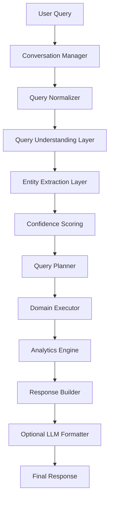

# V2 Architecture Plan

## Goal
Transform the chatbot into a deterministic, modular query platform while keeping the existing `v1` API stable.

## New Folder Structure
```text
app/
├── api/routes/chat_v2.py
├── v2/
│   ├── query_understanding/classifier.py
│   ├── normalizer.py
│   ├── semantic_matcher.py
│   ├── confidence.py
│   ├── entity_extraction/
│   ├── resolver.py
│   ├── planners/
│   ├── executors/
│   ├── memory/
│   ├── analytics/
│   ├── observability/
│   └── prompts/
```

## Phased Migration Plan
### Phase 1: Parallel V2 introduction
- Keep `/api/v1/chat` unchanged.
- Add `/api/v2/chat` backed by the new deterministic service.
- Reuse the existing MongoDB REST API and response formatter.

### Phase 2: Controlled traffic shift
- Route internal or low-risk tenants to V2 first.
- Compare latency, confidence, and unknown-query rates.
- Keep fallback to the legacy path for edge cases.

### Phase 3: Legacy decomposition
- Split `chat_service.py` responsibilities into V2 modules.
- Replace hardcoded intent logic with planner-driven execution.
- Move analytics, GPS, shipment, and customer logic into dedicated executors.

### Phase 4: Operational hardening
- Add persistent observability if needed.
- Introduce Redis/vector DB later without changing the public API.
- Add queueing or event-driven ingestion only if throughput justifies it.

## Request Flow


## Example Query Plan
```json
{
  "domain": "shipment",
  "action": "count",
  "filters": {
    "status": "delayed",
    "state": "UP",
    "date": "today"
  }
}
```

## Multi-Intent Handling
- The classifier returns `primary_intent`, `secondary_intents`, and `confidence`.
- The planner keeps the primary executor deterministic and attaches secondary execution only when it is cheap and relevant.
- Example: shipment + delay + alert can fetch shipment core data once and append delay or alert sections.

## Fallback Handling
- If entities are missing and confidence is low, the service asks a clarification question.
- Optional LLM use is restricted to summarization and formatting.
- If the LLM fails, the deterministic reply is returned unchanged.

## Low-Cost Recommendations
- Keep all core routing deterministic.
- Use in-memory TTL caches and `lru_cache` for small static lookups.
- Avoid token-heavy prompts in the hot path.
- Defer Redis, vector search, and Kafka until there is a measured need.

## Production Standards
- Keep async I/O end-to-end.
- Keep domain execution isolated from orchestration.
- Prefer composition over giant service classes.
- Log trace IDs, latency, intent confidence, and unknown queries.
- Preserve backward compatibility while migrating traffic gradually.